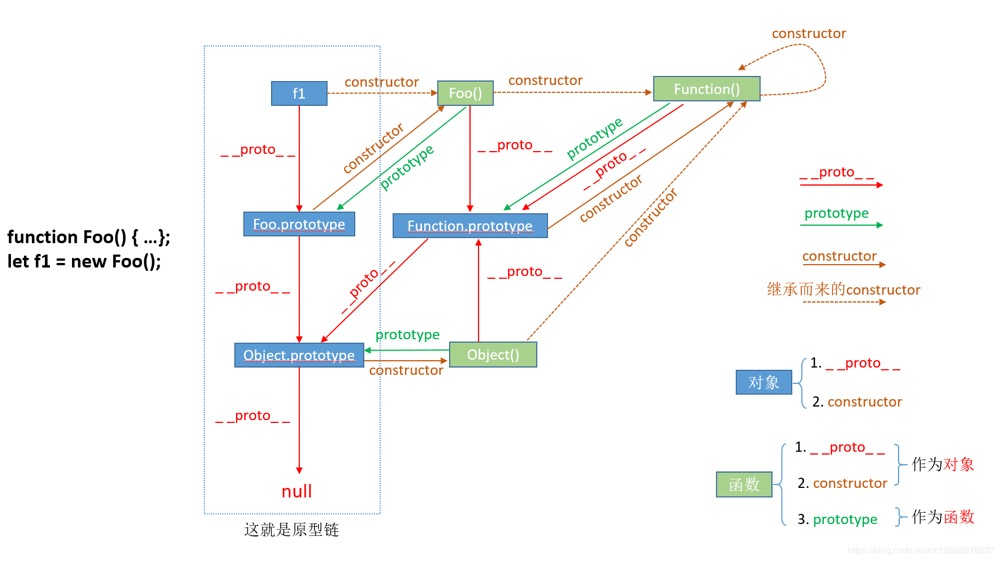
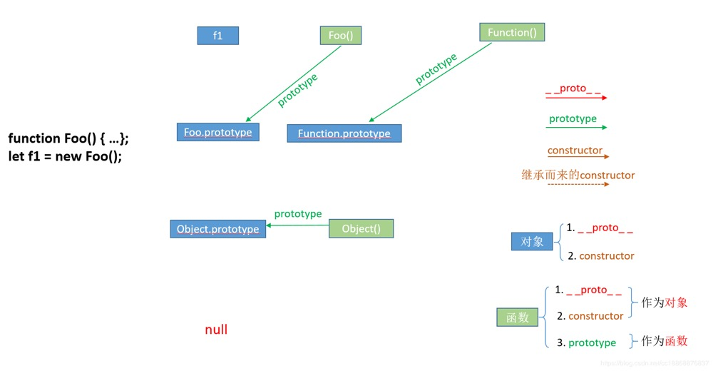
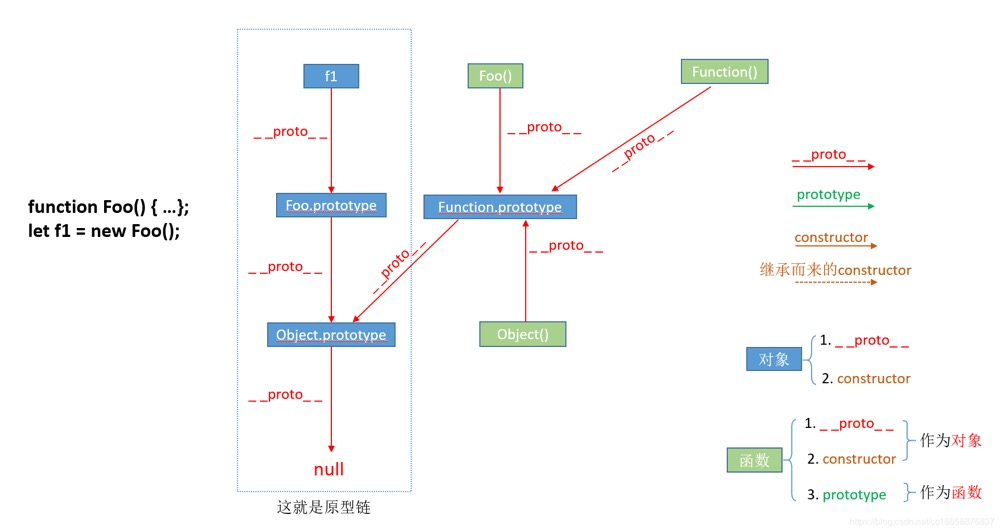

#### 说一下原型链是什么？
* 原型链基本思想是利用原型让一个引用类型`继承`另一个引用类型的属性和方法。
* 搞懂原型对象和原型链其实就是搞懂 prototype、__proto__ 和 constructor 之间的相互关系。



在 JavaScript 中，这三者之间依附在不同的引用对象类型上。

1. `对象`：`__proto__` 和 `constructor` 是对象独有的。
2. `函数`：`prototype` 是函数独有的。`但是函数也是对象`，所以函数也有 `__proto__ 和 constructor`。

#### 显式原型prototype
* 显式原型对象 prototype 由函数所独有，它是从一个函数指向另一个对象。它的含义是`函数的原型对象`
* 任何函数在创建的时候，其实会默认同时创建该`函数的 prototype 对象`。


#### 隐式原型
* 在 JavaScript 中的对象中都有一个 `__proto__` 属性，从上图可以看出一个对象指向另一个对象，即指向相对应的对象的原型对象。
* 这个原型对象称为`隐式原型对象`。
* 隐式原型对象的作用在于，当访问一个对象的属性或方法时，如果该对象内部不存在这个属性，
* 那么就会从它的 __proto__ 属性所指向的（原型）对象中寻找（原型也是对象，也有它自己的原型），
* 如果原型对象中也找不到，就会继续在该原型对象的原型对象中找，以此类推，直到找到属性或方法为止，或者查找到顶层原型对象 null，就结束查找，返回 undefined。
* 整个查找过程中，`从当前对象出发沿着原型对象（__proto__）构成的链条查找`相关属性和方法直到结束，
* 这些相互关联的对象组成的链条就是`原型链`。


#### 构造函数
* 属性 constructor 也是对象才拥有的，它是从一个对象指向一个函数，含义就是`指向该对象的构造函数`，
* 每个对象都有构造函数（本身拥有或继承而来，继承而来的要结合 __proto__ 属性查看会更清楚点），
* 从上图中可以看出 `Function` 这个对象比较特殊，`它的构造函数就是它自己`
* （因为 Function 可以看成是一个函数，也可以是一个对象），
* 所有函数和对象最终都是由 Function 构造函数得来，
* 所以 `constructor` 属性的`终点`就是 `Function` 这个函数。

#### 原型对象
* 原型对象即为当前实例对象的父对象

1. 显式原型对象:
* 属性 prototype
* 函数独有
* 定义函数时被自动赋值，值默认为 {}
* 用于实现基于原型的继承与属性的共享

2. 隐式原型对象
* 属性 __proto__
* 对象独有（函数也是对象，因此函数也有该属性）
* 在创建实例对象时被自动添加，并赋值为构造函数的 prototype 值
* 构成原型链，同样用于实现基于原型的继承

* 代码示例：访问原型链中的原型对象
```javascript
const Foo = function () {};

const foo = new Foo();

// 构造函数 Foo {} 是函数 foo 的原型对象
console.log(foo.__proto__);
console.log(foo.constructor === Foo); // true
console.log(foo.__proto__===Foo); // false
console.log(foo.__proto__===Foo.prototype); // true

// 构造函数 Object {} 是函数 Function 的原型对象
console.log(foo.__proto__.__proto__);
console.log(foo.__proto__.__proto__===Object.prototype); // true

console.log(foo.constructor.constructor === Function); // true
// constructor的终点是Function，Function的构造器函数指向自身
console.log(foo.constructor.constructor.constructor === Function); // true

// 原型链顶层
console.log(foo.__proto__.__proto__.__proto__); // null
```

### 原型对象的指向
* __proto__ 的指向取决于对象创建时的实现方式。

#### 字面量方式
* 当通过字面量方式创建对象时，它的原型就是 Object.prototype。
* 虽然我们无法直接访问内置属性 __proto__，但我们可以通过 Object.getPrototypeOf() 或对象的属性 __proto__ 获取对象的原型。
```javascript
const foo = {};
console.log(foo.__proto__ === Object.prototype);
// true
console.log(Object.getPrototypeOf(foo) === Object.prototype);
// true
```
#### 构造器方式
```javascript
const Foo = function () {};

const foo = new Foo();

console.log(foo.__proto__ === Foo.prototype);
// true

console.log(Object.getPrototypeOf(foo) === Foo.prototype);
// true
```

#### Object.create 方式
```javascript
const foo = {};
const bar = Object.create(foo);

console.log(bar.__proto__ === foo); // true
function F(){
}
let obj = Object.create(F.prototype);
console.log(obj.__proto__ === F.prototype); // true
```

#### 原型对象与实例
* 通过 instanceof 操作符可以确定原型与实例的关系。
```javascript
// 假设 instanceof 操作符左边是 L 右边是 R
L instanceof R

// instanceof 运算时 通过判断 L 的原型链是否存在 R.prototype
L.__proto__.__proto__... === R.prototype
```
* 注意：instanceof 操作符会递归查找 L 的原型链，即 L.__proto__.__proto__.__proto__... 直到找到了或者到达顶层为止。

1. 构造器 Function 的构造器是它自身：
```javascript
Function.constructor === Function; // true
```
2. 构造器 Object 的构造器是 Function（因此可得所有构造器的 constructor 都指向 Function）
```javascript
Object.constructor === Function; // true
```
3. 构造器 Function 的 [[Prototype]] 是一个特殊的匿名函数
```javascript
console.log(Function.__proto__); // function(){}
```
* 这个特殊的匿名函数的 [[Prototype]] 指向 Object 的 prototype 原型。
```javascript
Function.__proto__.__proto__ === Object.prototype; // true
```
4. Object 的 [[Prototype]] 指向 Function 的 prototype 也就是上述的特殊的匿名函数
```javascript
Object.__proto__ === Function.prototype; // true

Function.prototype === Function.__proto__; // true
```
5. 内置对象 Function 和 Object 的关系：
```javascript
Function instanceof Object; // true
Object instanceof Function; // true
```
6. 其他数据类型数据
```javascript
    console.log(true.__proto__ === Boolean.prototype);// true
    console.log(true.__proto__.__proto__ === Object.prototype);// true

    console.log((123).__proto__ === Number.prototype);// true
    console.log((123).__proto__.__proto__ === Object.prototype);// true

    console.log('String'.__proto__ === String.prototype);// true
    console.log('String'.__proto__.__proto__ === Object.prototype);// true

    console.log({}.__proto__ === Object.prototype);// true
    console.log({}.__proto__.__proto__ === null);// true

    console.log([].__proto__ === Array.prototype); // true
    console.log([].__proto__.__proto__ === Object.prototype);// true
    console.log([].__proto__.__proto__.__proto__ === null);// true
```


