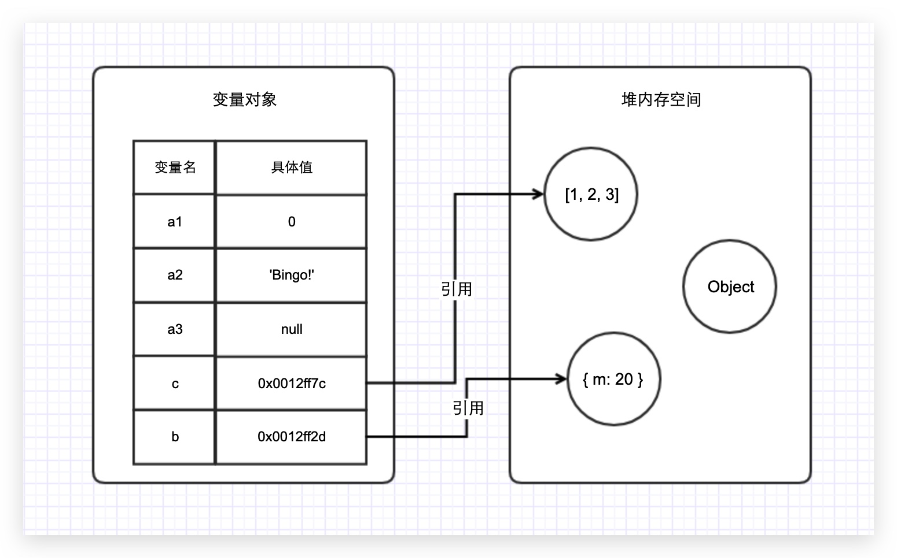
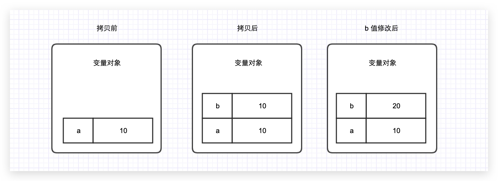
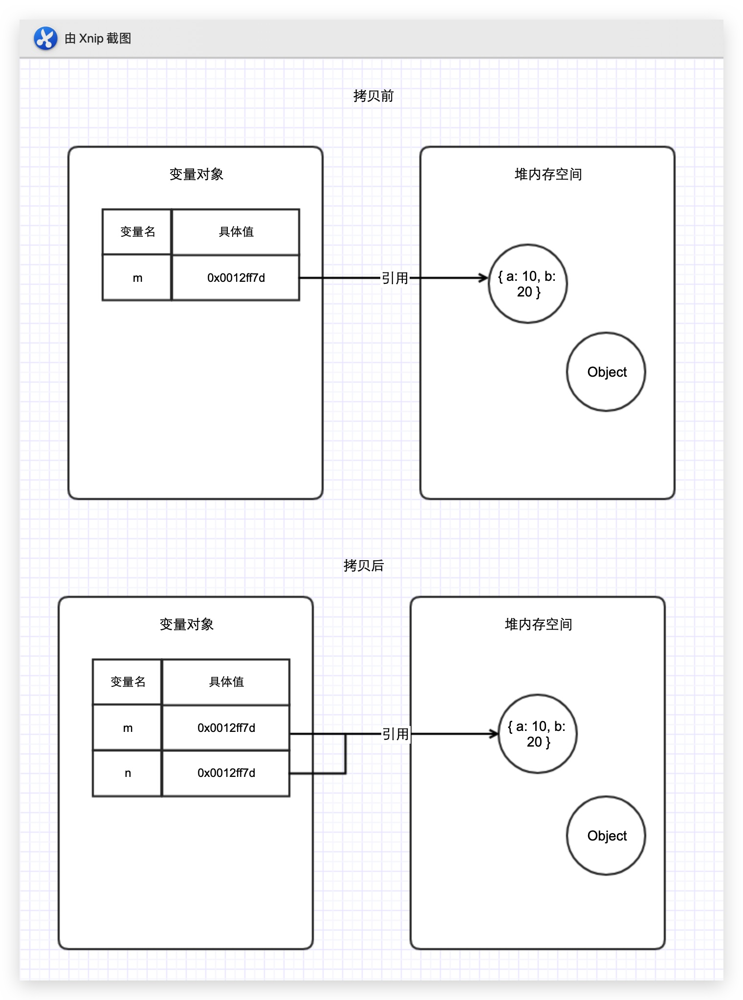

## 内存模型
* JavaScript 内存空间分为 栈（Stack）、堆（Heap）、队列（一般也会归类为栈中）。其中 栈 存放变量，堆 存放复杂对象，队列 存放常量。

#### 栈数据结构
* JavaScript 的 执行上下文。执行上下文的执行顺序借用了栈数据结构的存取方式。
* `栈` `先进后出`

#### 堆数据结构
* `堆数据结构是一种树状结构。它的存取数据的方式，则与书架与书非常相似。`
* 书虽然也整齐的存放在书架上，但是我们只要知道书的名字，我们就可以很方便的取出我们想要的书
* 好比在 `JSON` 格式的数据中，我们存储的 `key-value` 是可以无序的，因为顺序的不同并不影响我们的使用，我们只`需要关心书的名字(key)`。

#### 队列数据结构
* 队列是一种`先进先出（FIFO）`的数据结构。正如排队过安检一样，排在队伍前面的人一定是最先过检的人。用以下的图示可以清楚的理解队列的原理。

### 基础数据类型在栈内存
* JavaScript 的 执行上下文 生成之后，会创建一个叫做 变量对象 的特殊对象，JavaScript 的基础数据类型往往都会保存在变量对象中。

* `JavaScript 中的基础数据类型，这些值都有固定的大小，往往都保存在栈内存中（闭包除外），由系统自动分配存储空间`
* `我们可以直接操作保存在栈内存空间的值，因此基础数据类型都是按值访问`

### 引用数据类型在堆内存
* `引用数据类型的值是保存在堆内存中的对象`。JavaScript `不允许直接访问`堆内存中的位置，因此我们不能直接操作对象的堆内存空间
* 在操作对象时，实际上是在操作对象的引用而不是实际的对象。因此，引用类型的值都是`按引用访问`的
* 这里的引用就像书架上的书，我们只需要知道书名就可以找到书。就像通过key找到value一样

* 看个例子
```javascript
// 变量对象
var a1 = 0;
// 变量对象
var a2 = 'Bingo!';
// 变量对象
var a3 = null;

// 变量 c 存在于变量对象中，[1, 2, 3] 作为对象存在于堆内存中
var c = [1, 2, 3];
// 变量 b 存在于变量对象中，{m: 20} 作为对象存在于堆内存中
var b = { m: 20 };
```


### 数据拷贝
#### 基本数据类型
```javascript
let a = 10;
let b = a;
b = 20;
console.log(a,b); // 10,20
```
* 在变量对象中`基本数据类型`的数据发生拷贝操作时，`系统会自动为新的变量分配一个新值`。
* let b = a 赋值操作执行后，虽然变量 a 和变量 b 均为 10，但是它们其实已经是相互独立互不影响的值了。


#### 引用数据类型
```javascript
const m = { a: 10, b: 20 };
const n = m;
n.a = 15;
```
* 引用类型的拷贝会为新的变量自动分配一个`内存地址`保存在变量对象中
* `注意：分配至变量n的这个内存地址和m指向的内存地址是一致的`


### 总结
#### 栈内存
存储基础数据类型
按值访问
存储的值大小固定
由系统自动分配内存空间
主要用来执行程序
空间小，运行效率高
先进后出

#### 堆内存
存储引用数据类型
按引用访问
存储的值大小不定，可以动态调整
由开发者通过代码进行内存空间分配
主要用来存放对象
空间大，但是效率低
无序存储，可以根据引用直接获取


如果老年代几乎已满，并且提供给任务的截止时间估计足够长以完成收集，则在空闲任务期间安排完整的垃圾收集。收集暂停时间是根据标记速度乘以分配的对象数量来预测的。
`仅当网页闲置很长一段时间时，才会执行带有额外压缩的完整垃圾收集。`


