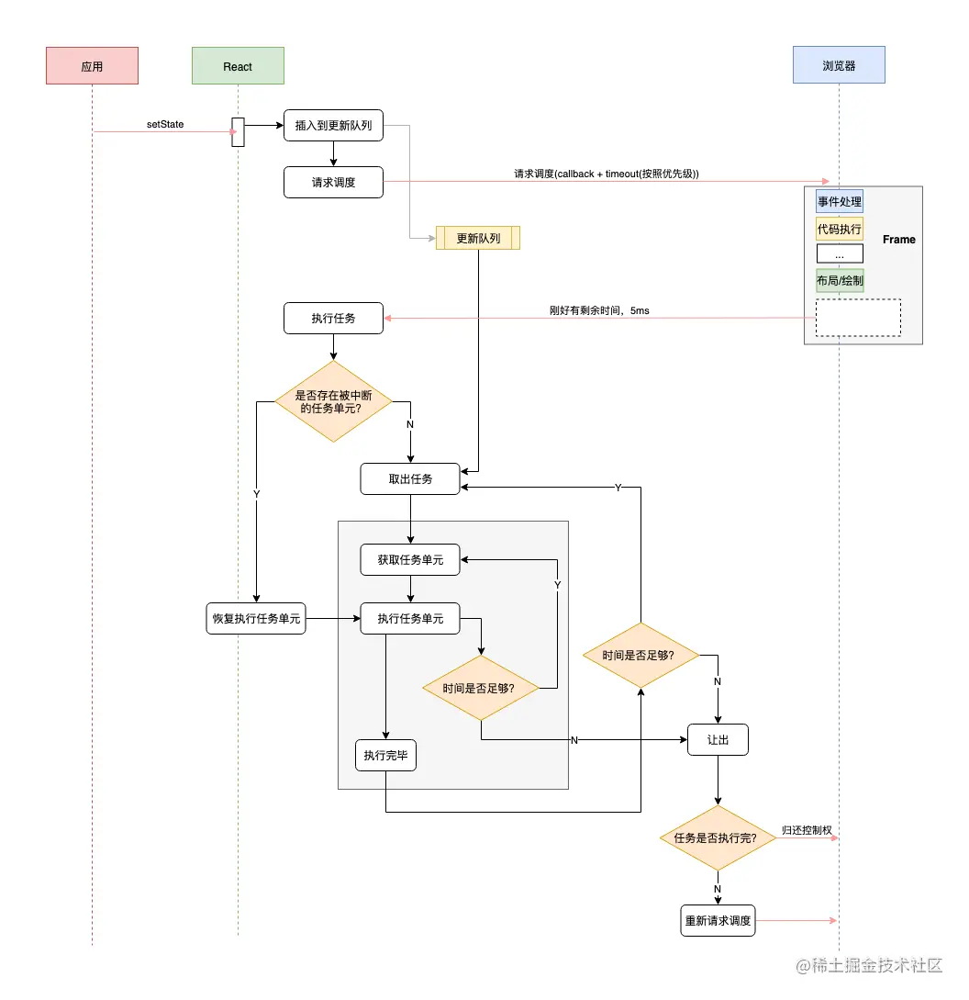

## fiber
* [参考]("https://juejin.cn/post/6844903975112671239")
* `虚拟DOM在React中有个正式的称呼——Fiber`
* `fiber架构是一种树状复杂链表结构;而且没有反向链表`


## 单线程处理调度系统
* 微软dos是一个单任务操作系统，这种操作系统同一时间只允许运行一个程序。
* 也可以说说是一种压根没有任务调度的"残疾"操作系统
* 在单任务操作系统中，如果想执行多个任务，只能等待上一个进程退出，然后再载入下一个新的进程。

* 现在操作系统都是多任务操作系统。进程的调度策略是按照cpu核心数量来划分的，可以分为`单处理器调度和多处理器调度`
* `javascript的运行机制可以类比为单处理器调度！`

* `为了实现进程的并发，操作系统会按照一定的调度策略，将cpu的执行权分配给多个进程，多个进程都有被执行的机会，让他们交替执行。`
* `但是对于单处理器系统，其实就是一种同时在运行的假象。因为只有一个处理器，只能交替使用执行权，只是cpu执行速度太快`
* `所以人类根本感觉不到。但是在实际的单核无力环境下，同时只能有一个程序在运行`
* `这种就是并发。最常见的例子就是单处理器下，交替执行多个进程，只是速度很快，所以看起来是同时执行。就像一边打字，一边看显示器`

* `而并行不一样，而是真的有多个处理器(需要物理层面的支持)去执行多个进程。就像影分身一样，的确可以一边吃饭，一边睡觉，都是长时间的活动，但是的确可以同时执行`

## 类比javascript执行环境
* javascript是单线程运行的，就像单行道一样，就像单处理系统一样，同一时间只能做一件事！
* 由于javascript是单线程执行的，并且在浏览器有很多事情需要做，需要负责`页面的js解析和执行，绘制，事件处理，静态资源加载和处理。这些事情可以类比单处理器系统的多进程并发情况`
* `所以为什么会存在卡顿，白屏的情况呢？就是因为存在一个任务一致在执行，霸占着cpu，导致后面的任务都无法执行，所以浏览器才会呈现出卡死的状态`
---
* 对于前端框架来说，为了解决这种问题，有三个方向
1. 优化每个任务，尽量变快一些。 `vue`
2. 快速响应用户，让用户觉得够快，不能阻塞用户的交互。`react`
3. 尝试worker多线程

## fiber架构是什么
* 在react里面，进行渲染的时候会递归对比virtualDOM树，找到需要变动的节点，然后同步更新它们，这个过程被称为Reconcilation (协调)
* 在Reconcilation期间，react会霸占着浏览器资源，一则导致用户触发的事件得不到响应，二则会导致掉帧。用户可以感知到这些卡顿
* `react的reconcilation是cpu密集型的操作，相当于我们上面说的长进程。所以初衷和进程调度一样`
* 我们需要让高优先级的进程或者短进程优先运行，不能让长进程长期霸占资源。
* react优化：
* `给用户制造一种应用很快的假象：将浏览器的渲染，布局，绘制，资源加载，事件响应，脚本执行等视作操作系统的进程，通过某个调度策略合理地分配cpu资源`
* `从而提高浏览器的用户响应速率，同时兼顾任务执行效率`

#### 为什么需要fiber?
* ` react通过fiber架构，让自己的reconcilation过程变成可被中断的。适时的让出cpu执行权`
* 除了可以让浏览器及时地响应用户的交互，还有其他好处：
* `与其一次性操作大量dom节点，分批延时对dom进行操作，可以得到更好的用户体验`
* `给浏览器一点喘息的机会，浏览器会对代码进行编译优化(JIT)及进行热代码优化，或者对reflow进行修正`

## 什么是fiber
1. 一种流程控制原语
* `fiber也称为协程。类似于lua的coroutine，es6的generator`
* `其实协程和线程并不一样，协程本身是没有并发或者并行能力的(需要配合线程)，只是一种控制流程的让出机制`
* 普通的函数执行过程中是无法被中断和恢复的:
```typescript jsx
const tasks = []
function run() {
  let task
  while (task = tasks.shift()) {
    execute(task)
  }
}
```
* `而协程是可以在执行过程中被中断和恢复的，例如generator`
```typescript jsx
const tasks = []
function * run() {
  let task

  while (task = tasks.shift()) {
    // 🔴 判断是否有高优先级事件需要处理, 有的话让出控制权
    if (hasHighPriorityEvent()) {
      yield
    }

    // 处理完高优先级事件后，恢复函数调用栈，继续执行...
    execute(task)
  }
}
```

* `react fiber的思想和协程的思想是契合的：react渲染的过程可以被中断，可以将控制权交回给浏览器，让位给高优先级的任务，浏览器空闲后再恢复渲染`

* 几个问题：
1. 浏览器没有抢占的条件，所以react只能用让出机制？
2. 怎么确定有高优先级的任务要处理，也就是什么时候要让出？
3. react为什么不直接用generator?

#### fiber的主动让出机制
* 一是浏览器没有类似进程的概念(应该是一个程序就是一个进程，没有多进程操作能力)，任务之间的界限很模糊，没有上下文，所以不具备中断/恢复的条件
* 二是没有抢占的机制，无法中断一个正在执行的程序

* 所以我们只能采用类似协程这样的控制权让出机制。这个和上文提到的进程调度策略不同，又一个更专业的名词。`合作式调度`
* 合作式调度是一种契约调度，要求程序和刘安琪紧密结合，互相信任。比如浏览器会给我们分配执行时间片，我们要按照约定在这个时间内执行完毕，并且将ko
* 通俗来讲就是：
* 以前程序是老子，想要怎么执行就怎么执行，想执行多久就执行多久。但是现在为了用户体验，现在一切交给浏览器去调度
* 程序需要向浏览器申请执行权，但是这个执行权有期限，借了之后需要按照规定归还给浏览器。
* `缺点就在于，如果用户超时不还控制权，浏览器也没有办法，所以合作式调度的缺点就在于，如果程序写得烂，那么就容易卡顿。`

#### 怎么让出？
* 在目前浏览器中，前端无法判断当前是否有更高优先级的任务等待被执行。只能换一个思路
* `通过超时检查的机制来让出控制权。解决方案：确定一个合理的运行时长，然后在合适的检查点监测是否超时(每执行一个小任务)`
* `如果超时就停止执行，将控制权交还给浏览器。`
----
* 举个例子就是requestIdleCallback的实现
* 浏览器在一帧内会执行下列任务，而且他们的执行顺序基本是固定的：
* 处理用户输入事件、js执行、requestAnimationFrame调用、布局layout、绘制paint
* `等待浏览器执行完上诉的任务，然后在这一帧时间里面还有剩余时间，浏览器就会调用requestIdleCallback的回调函数`

#### fiber不用generator的原因
1. generator不能再栈中间让出。比如想在嵌套的函数调用中间让出，首先需要将这个函数调用中间让出，然后需要将这些函数都包装成generator
2. generator是有状态的，很难在中间恢复这些状态。

### fiber是一个执行单元
* fiber的另一种解释是纤维，这是一种数据结构或者说执行单元。每次执行完一个执行单元，react就会检查现在还剩多少时间，如果没有多少时间就将控制权让出去
* 上文说了，react没有使用generator这些语言的让出机制，而是实现了自己的调度让出机制。这个机制就是基于 fiber这个执行单元的。
* 执行单元的执行过程如下：
* 假设用户调用setState更新组件，这个待更新的任务会先放入队列中，然后通过requestIdleCallback请求浏览器调度
```typescript jsx
updateQueue.push(updateTask);
requestIdleCallback(performWork, {timeout});
```
* `然后浏览器有空闲或者超时了就会调用performWork来执行任务：`
```typescript jsx
// 1️⃣ performWork 会拿到一个Deadline，表示剩余时间
function performWork(deadline) {

  // 2️⃣ 循环取出updateQueue中的任务
  while (updateQueue.length > 0 && deadline.timeRemaining() > ENOUGH_TIME) {
    workLoop(deadline);
  }

  // 3️⃣ 如果在本次执行中，未能将所有任务执行完毕，那就再请求浏览器调度
  if (updateQueue.length > 0) {
    requestIdleCallback(performWork);
  }
}
```
* `workLoop函数的工作就是从更新队列updateQueue中弹出更新任务来执行，每执行完一个执行单元，就检查一下剩余时间是否充足`
* `如果充足就进行执行下一个执行单元，反之则停止执行，保存现场。等下一次有执行权时再恢复`
```typescript jsx
// 保存当前的处理现场
let nextUnitOfWork: Fiber | undefined // 保存下一个需要处理的工作单元
let topWork: Fiber | undefined        // 保存第一个工作单元

function workLoop(deadline: IdleDeadline) {
  // updateQueue中获取下一个或者恢复上一次中断的执行单元
  if (nextUnitOfWork == null) {
    nextUnitOfWork = topWork = getNextUnitOfWork();
  }

  // 🔴 每执行完一个执行单元，检查一次剩余时间
  // 如果被中断，下一次执行还是从 nextUnitOfWork 开始处理
  while (nextUnitOfWork && deadline.timeRemaining() > ENOUGH_TIME) {
    // 下文我们再看performUnitOfWork
    nextUnitOfWork = performUnitOfWork(nextUnitOfWork, topWork);
  }

  // 提交工作，下文会介绍
  if (pendingCommit) {
    commitAllWork(pendingCommit);
  }
}
```

## React的fiber改造
#### 1.数据结构的调整
* 在react16之前，reconciliation是同步的，递归执行的，也就是说这是基于函数调用栈的reconcilation算法，也称为stack reconcilation
* `栈非常适合树这种嵌套数据结构的处理，但是这种依赖于调用栈的方式不能随意中断，很难被恢复，也不利于异步处理。`
* 如果我们需要恢复递归现场，需要从头开始，恢复到之前的调用栈

* 首先需要对react现有的数据结构进行调整，模拟函数调用栈，将之前需要递归进行处理的事情分解成增量的执行单元，将递归转换为迭代
* `react目前的做法是使用链表，每个virtualDOM节点内部现在使用Fiber表示，它的结构大概如下：`
```typescript jsx
export type Fiber = {
  // Fiber 类型信息
  type: any,
  // ...

  // ⚛️ 链表结构
  // 指向父节点，或者render该节点的组件
  return: Fiber | null,
  // 指向第一个子节点
  child: Fiber | null,
  // 指向下一个兄弟节点
  sibling: Fiber | null,
}
```
* `使用链表结构只是一个结果，而不是目的，react一开始就是冲着模拟调用栈取得！`
* react fiber也被称为虚拟栈帧
```text

          函数调用栈   Fiber
基本单位    函数        Virtual DOM 节点
输入       函数参数    Props
本地状态    本地变量    State
输出      函数返回值    React Element
下级      嵌套函数调用   子节点(child)
上级引用    返回地址    父节点(return)
```
* fiber和调用栈帧一样，保存了节点处理的上下文信息。`因为react的调用栈帧是手动实现的，所以更加可控，可以保存在内存中，随时中断和恢复`
* 有了这种链表的数据结构调整，就可以迭代的处理这些节点了，看下 performUnitOfWork 的实现 `(其实就是一个深度优先遍历)`
```typescript jsx
/**
 * @params fiber 当前需要处理的节点
 * @params topWork 本次更新的根节点
 */
function performUnitOfWork(fiber: Fiber, topWork: Fiber) {
  // 对该节点进行处理
  beginWork(fiber);

  // 如果存在子节点，那么下一个待处理的就是子节点
  if (fiber.child) {
    return fiber.child;
  }

  // 没有子节点了，上溯查找兄弟节点
  let temp = fiber;
  while (temp) {
    completeWork(temp);

    // 到顶层节点了, 退出
    if (temp === topWork) {
      break
    }

    // 找到，下一个要处理的就是兄弟节点
    if (temp.sibling) {
      return temp.sibling;
    }

    // 没有, 继续上溯
    temp = temp.return;
  }
}
```
* `因为使用了链表结构，即使处理流程被中断了，我们随时可以从上次未处理的Fiber继续遍历下去`

#### 2.两个阶段的拆分
* `我们使用chrome的perfomance工具去查看一次点击事件，可以看到每次渲染都会有两个阶段：recocilation协调阶段和commit提交阶段`
* 协调阶段：可以认为是diff阶段，`协调阶段可以被中断；协调阶段会找出所有节点变更`，例如节点新增、删除、属性变更等，这些变更被react称为effect副作用
* 以下生命周期钩子会在协调阶段被调用(`由于可以被中断，所有可能会被调用多次`):
```text
constructor
componentWillMount 废弃
componentWillReceiveProps 废弃
static getDerivedStateFromProps
shouldComponentUpdate
componentWillUpdate 废弃
render
```
* 提交阶段：`将上个阶段计算出来的需要处理的effect一次性执行，这个阶段必须同步执行，不能被打断！`
* 以下生命周期钩子会在提交阶段被调用
```text
getSnapshotBeforeUpdate() 严格来说，这个是在进入 commit 阶段前调用
componentDidMount
componentDidUpdate
componentWillUnmount
```

* `也就是，在协调阶段如果时间片用完了，react就会让出控制权。因为协调阶段执行的工作不会导致任何可见的变更，即使让出控制权也没有问题`
* `但是提交阶段，我们会对副作用effect进行处理，包括dom变更，异步请求等等。所以我们只能同步执行，并且必须按照顺序去只调用一次！`

* `React 协调阶段的生命周期钩子可能会被调用多次!, 例如 componentWillMount 可能会被调用两次。`
---
* 分为两个阶段的好处：
* 不必担心在渲染阶段或者说协调阶段，出现内存泄漏，因为在协调阶段不会产生副作用effect
* 如果在渲染组件时发生错误，React可以安全地丢弃任何正在进行的工作，并让错误边界决定要渲染的内容。
* 如果要渲染的组件很多，React可以将要处理的工作拆分为更小的块，以避免阻塞浏览器。一旦所有组件都呈现出来，React就可以（同步）提交工作，例如更新DOM。
* react可以优先考虑工作。如果在低优先级工作进行的同时安排了高优先级工作，React可以安全地将低优先级工作留到以后，然后开始处理高优先级工作。由于React仅在提交阶段对DOM等应用更新，因此它从不担心应用程序处于部分更新（中断）状态。

#### 3.Reconciliation
* fiber包含的属性可以分为五个部分：
1. 结构信息：fiber使用链表来表示节点在树中的定位
2. 节点类型信息：tag表示节点的分类，type表示具体的类型值(如div,MyComponent)
3. 节点的状态：节点的组件实例、props,state等。将影响组件的输出
4. 副作用effect:在reconcilation过程中发现的副作用就保存在节点的effectTag中,那么使用链表将本次渲染的所有节点副作用都收集起来
* 在遍历过程中，react会将所有副作用effect的节点都通过nextEffect连接起来
5. 替身:`react在reconcilation过程中会构建一颗新的树(WIP树,workinProgress tree)`
* `可以认为是一颗表示当前工作进度的树。还有一颗表示已渲染界面的旧树，react就是一边和旧树对比，一边构建WIP树。`
---
* 首先看下beginWork是如何对fiber进行对比的
```typescript jsx
function beginWork(fiber: Fiber): Fiber | undefined {
  if (fiber.tag === WorkTag.HostComponent) {
    // 宿主节点diff
    diffHostComponent(fiber)
  } else if (fiber.tag === WorkTag.ClassComponent) {
    // 类组件节点diff
    diffClassComponent(fiber)
  } else if (fiber.tag === WorkTag.FunctionComponent) {
    // 函数组件节点diff
    diffFunctionalComponent(fiber)
  } else {
    // ... 其他类型节点，省略
  }
}
```
* 宿主节点对比
```typescript jsx
function diffHostComponent(fiber: Fiber) {
  // 新增节点
  if (fiber.stateNode == null) {
    fiber.stateNode = createHostComponent(fiber)
  } else {
    updateHostComponent(fiber)
  }

  const newChildren = fiber.pendingProps.children;

  // 比对子节点
  diffChildren(fiber, newChildren);
}
```
* 类组件节点对比也差不多
```typescript jsx
function diffClassComponent(fiber: Fiber) {
  // 创建组件实例
  if (fiber.stateNode == null) {
    fiber.stateNode = createInstance(fiber);
  }

  if (fiber.hasMounted) {
    // 调用更新前生命周期钩子
    applybeforeUpdateHooks(fiber)
  } else {
    // 调用挂载前生命周期钩子
    applybeforeMountHooks(fiber)
  }

  // 渲染新节点
  const newChildren = fiber.stateNode.render();
  // 比对子节点
  diffChildren(fiber, newChildren);

  fiber.memoizedState = fiber.stateNode.state
}
```
* 子节点对比
```typescript jsx
function diffChildren(fiber: Fiber, newChildren: React.ReactNode) {
  let oldFiber = fiber.alternate ? fiber.alternate.child : null;
  // 全新节点，直接挂载
  if (oldFiber == null) {
    mountChildFibers(fiber, newChildren)
    return
  }

  let index = 0;
  let newFiber = null;
  // 新子节点
  const elements = extraElements(newChildren)

  // 比对子元素
  while (index < elements.length || oldFiber != null) {
    const prevFiber = newFiber;
    const element = elements[index]
    const sameType = isSameType(element, oldFiber)
    if (sameType) {
      newFiber = cloneFiber(oldFiber, element)
      // 更新关系
      newFiber.alternate = oldFiber
      // 打上Tag
      newFiber.effectTag = UPDATE
      newFiber.return = fiber
    }

    // 新节点
    if (element && !sameType) {
      newFiber = createFiber(element)
      newFiber.effectTag = PLACEMENT
      newFiber.return = fiber
    }

    // 删除旧节点
    if (oldFiber && !sameType) {
      oldFiber.effectTag = DELETION;
      oldFiber.nextEffect = fiber.nextEffect
      fiber.nextEffect = oldFiber
    }

    if (oldFiber) {
      oldFiber = oldFiber.sibling;
    }

    if (index == 0) {
      fiber.child = newFiber;
    } else if (prevFiber && element) {
      prevFiber.sibling = newFiber;
    }

    index++
  }
}
```
* `在reconcilation协调阶段完成后。WIP树上会对需要变更的节点打上标签，在提交阶段，react就会将这些打上标签的节点进行变更！`

#### 4. 双缓冲
* `WIP树这种技术 类似于图形学上的双缓冲技术`，图形化引擎一般会使用双缓冲技术，先将图片绘制到一个缓冲区，再一次性绘制到屏幕显示，这样可以防止屏幕抖动，优化渲染性能！
* `在react中，wip树就是一个缓冲，它在reconcilation完毕后一次性提交给浏览器进行渲染。`
* `WIP树可以减少内存分配和垃圾回收。WIP的节点不一定完全是新的，例如某颗子树不需要变动，那么react会克隆复用旧树上的节点，避免整棵树挂掉`
---
* `可以把WIP树当成git的旧树上fork出来的功能分支，在新的分支上新增或者删除特性，都不会影响到旧的分支。`
* `只有当WIP树(fork分支)完善完成后，合并到旧的分支上，将旧的分支进行替换，才会有影响。或许这也就是提交阶段名称的由来！`

#### 5.副作用的收集和提交
* 接下来就是把所有打了effect标记的节点串联起来，可以在completeWork中做，例如
```typescript jsx
function completeWork(fiber) {
  const parent = fiber.return

  // 到达顶端
  if (parent == null || fiber === topWork) {
    pendingCommit = fiber
    return
  }

  if (fiber.effectTag != null) {
    if (parent.nextEffect) {
      parent.nextEffect.nextEffect = fiber
    } else {
      parent.nextEffect = fiber
    }
  } else if (fiber.nextEffect) {
    parent.nextEffect = fiber.nextEffect
  }
}
```
* 最后将所有副作用都提交了
```typescript jsx
function commitAllWork(fiber) {
  let next = fiber
  while(next) {
    if (fiber.effectTag) {
      // 提交，偷一下懒，这里就不展开了
      commitWork(fiber)
    }
    next = fiber.nextEffect
  }

  // 清理现场
  pendingCommit = nextUnitOfWork = topWork = null
}
```

## Concurrent Mode并发模式
* 开启并发模式后，可以得到以下好处：
1. 快速响应用户输入和操作
2. 让动画更加流畅，通过调度，让应用保持高帧率
3. 利用好i/o操作空闲期或者cpu空闲期，进行一些预渲染。例如`离屏offscreen不可见内容，优先级最低，可以让react等到cpu空闲时才去渲染这部分内容。这和浏览器的preload技术差不多`
4. `使用好Suspense降低加载状态(load state)的优先级，减少闪屏。`，比如数据很快返回时，可以不必显示加载状态，而是直接显示出来，避免闪屏。
---
* vue的一个观点是：只要我们的更新够快，理论上就不需要时间分片了
---
* `时间分片并没有降低整体的工作量，该做的还是要做。因此react也在考虑在cpu空闲或者io空闲时做一些预渲染的工作`
* `注意：react的fiber其实是为了解决react更新效率低的问题而提出来的。所以fiber并不能给现有的应用的性能带来质的提升！`

