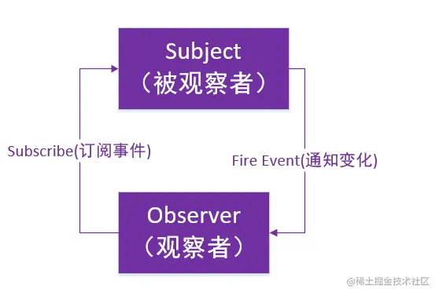
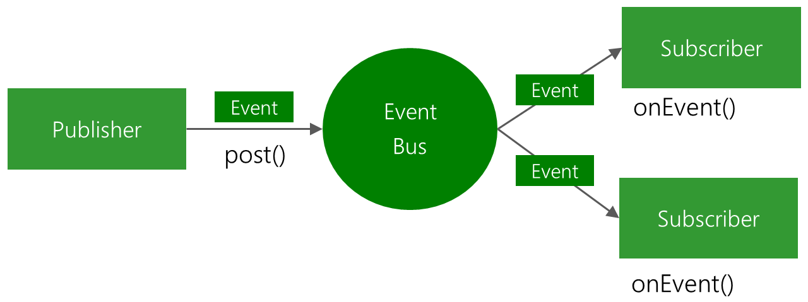

## 设计模式之一(原型模式)--实现继承
1. `原型模式是一种用于创建对象的模式，如果我们想创建一个对象，那么一般先指定对象类型，然后通过类来创建这个对象`
2. `原型模式不再关心对象的具体类型，而是找到一个对象，通过克隆的方式来创建一个一模一样的对象`
3. `如果需要一个跟某个对象一模一样的对象，那就可以使用原型模式；但是使用原型模式需要注意该语言是否提供了克隆的方法，javascript中就是Object.create方法`
```
			var one=function(){
				this.name='one';
				this.age=22;
			}
			var two=new one();
			console.log(two);
			two.name='two';
			two.age=11;//改变实例的属性
			console.log(two);
			//通过Object.create方法克隆一个和two实例一模一样的对象
			var two_child=Object.create(two);
			console.log(two_child);//two_child.__proto__指向two
			// 有些浏览器可能不支持Object.create方法,则使用
			Object.create=Object.create||function(obj){
				var F=function(){};
				F.prototype=obj;// 所以使用Object.create方法克隆其实就是创建一个对象指向obj,然后返回该对象的实例,由于该实例没有重新定义属性方法,所以自然寻找不到,就会通过__poto__属性往上查找到two对象,也就实现了克隆
				return new F();
			}
```
4. 原型模式同时也是一种编程范式，也存在原型编程的基本规则
* 1.所有书都是对象(但是在js中存在基本数据类型，所以js是绝大数是对象，但是所有对象都存在一个根对象，所有的对象都可以通过__proto__追溯到该对象)
```
			var one=new Object();
			// Object.getPrototypeOf()方法可以获取到对象的原型
			console.log(Object.getPrototypeOf(one));
			console.log(Object.getPrototypeOf(one)===Object.prototype);//true
			// 也就表明了通过new Object()得到的one实例的原型是Object.prototpe 
			// 并且js中所有的对象的原型(或者是最终原型指向)都是Object.prototype
```
* 2.要得到一个对象，不是通过实例化类，而是通过找到一个对象作为原型并克隆它
* `但是js一般不是通过new来创建对象吗？的确是，但是new运算符来调用函数时，此时的函数就是一个构造器`
* `使用new运算符来创建对象的过程其实就是先克隆Object.prototpe对象，然后再通过一些操作来进行克隆的过程`
* 3.对象会记住他的原型(`通过__proto__隐藏属性`)
* `每个对象的__proto__属性默认会指向它的构造器对象，也就是{Construtor}.prototype`
* 注意:不是所有浏览器都会公开__proto__属性
```
			var one=new Object();
			console.log(one.__proto__===Object.prototype);//true
			
			var Person=function () {};
			//修改obj对象的__proto__指向
			one.__proto__=Person.prototype;
			console.log(one.__proto__===Person.prototype);
```
* 4.如果对象无法响应某个请求，那么它会把该请求委托给它的构造器的原型，直到要一个可以处理该请求的对象为止
* `虽然在js中，每个对象的原型都是Object.prototype,但是通过修改__proto__指向可以改变对象原型`
```
//闭包封装
			var one=(function(){
				return {
					getName:function (name){
						return name;
					}
				}
			})();
			var one_child=function(){};
			// var one_child_child=new one_child();
			// console.log(one_child_child.getName('yiyi'));//往上找getName()方法,但是不存在
			
			one_child.prototype=one;//修改one_child原型指向为one函数
			var one_child_child=new one_child();
			console.log(one_child_child.getName('dsa'));//改变原型后,可以往上找到方法,这也就是继承,也就是原型链
```
* `任何对象，除了Object.prototype之外，都会有原型，而通过Object.create(null)可以创建出没有原型的对象`


```javascript
	// 单例模式(也就是无论只允许类或者对象创建一个实例，如果已创建则不能再创建)
	// 池塘(只能有一个池塘)
	let pond = (
		function(){
			let list;
			function init(){
				if(list) return list;
				else{
					list = [];
					return list;
				}
			}
			return {
				getPond(){
					return init()
				} 
			}
		}
	)()
	let a = pond.getPond()
	let b = pond.getPond()
	console.log(a)
	console.log(a === b);
	// 市场
	let market = (
		function(){
			let list;
			function init(){
				if(list) return list;
				else{
					list = [];
					return list;
				}
			}
			return {
				getMarket(){
					return init()
				} 
			}
		}
	)()
	let c = market.getMarket()
	let d = market.getMarket()
	console.log(c === d);
	
	/* 装饰器模式就是可以动态地给给某个对象添加一些额外的职责，
	而不会影响从这个类中派生的其他对象 */
	
	/* 很多时候我们不想去碰原函数，也许原函数是由其他同事编写的，里面的实现非常杂乱。甚
至在一个古老的项目中，这个函数的源代码被隐藏在一个我们不愿碰触的阴暗角落里。现在需要
一个办法，在不改变函数源代码的情况下，能给函数增加功能，这正是开放封闭原则给我们指
出的光明道路。
	 
	 例如:不确定一个window.onload事件是否已经被绑定，那么在不改动源代码的基础上进行修改*/
	window.onload=function(){console.log('别的人绑定了window.onload事件')}
	// 自己在源代码基础上进行修改
	let _o = window.onload;
	window.onload=function(){
		_o(); // 调用原方法
		console.log('自己在源代码基础上增加的代码')
	}
	/* 但是遇到的问题是1._o这个变量必须维护；
	2._o()虽然被调用了，但是如果window.onlad内部调用了this,那么我们就要注意this绑定的问题！ */
	
```

## 观察者模式和发布订阅模式的区别
* [参考]("https://blog.csdn.net/a469516684/article/details/86082844")
* 观察者模式中`被观察的对象背负了过多的逻辑，需要维护观察者列表，需要维护消息处理逻辑`

* `而发布订阅模式剥离出了单例的调度中心，以事件为驱动`
* `eventbus就是发布订阅模式，可见官网https://github.com/greenrobot/EventBus`





